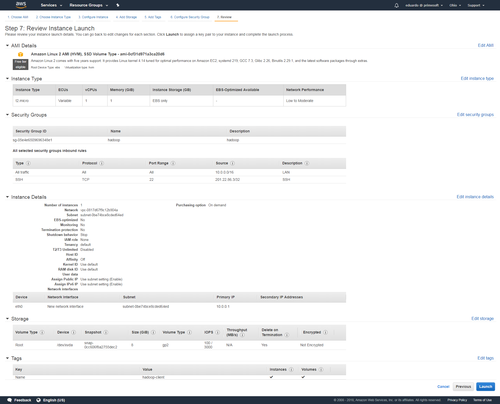
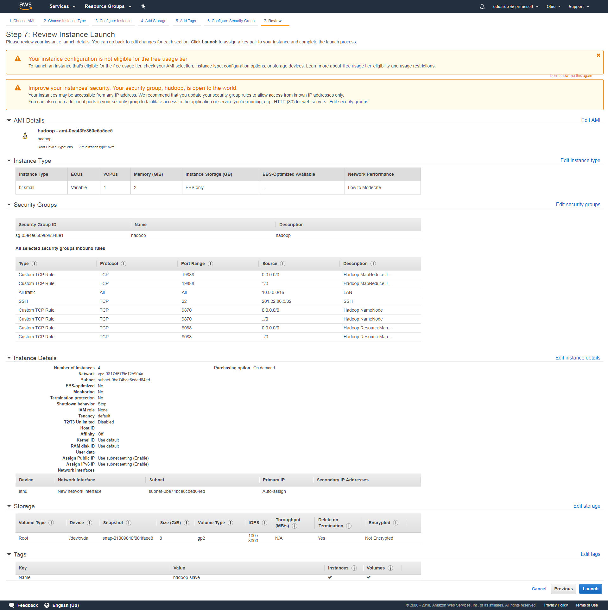
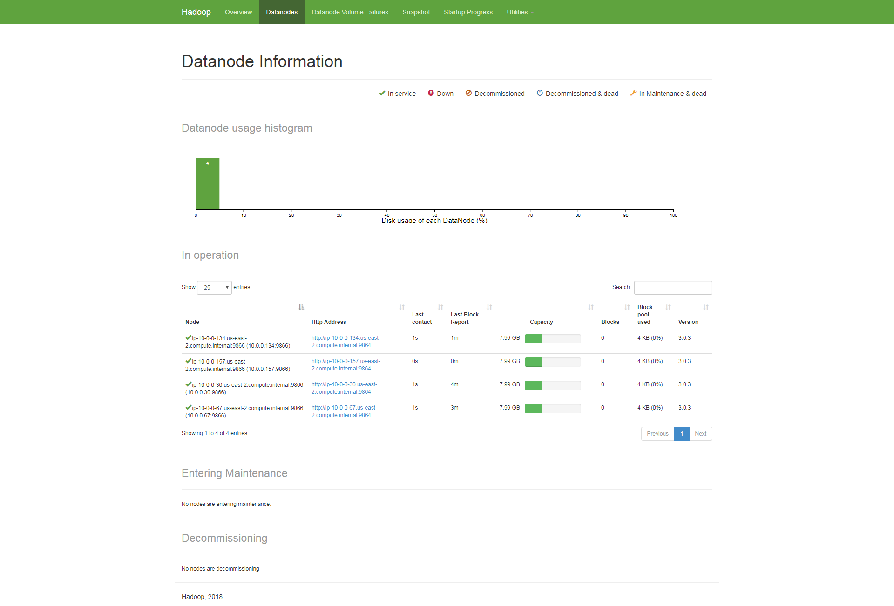
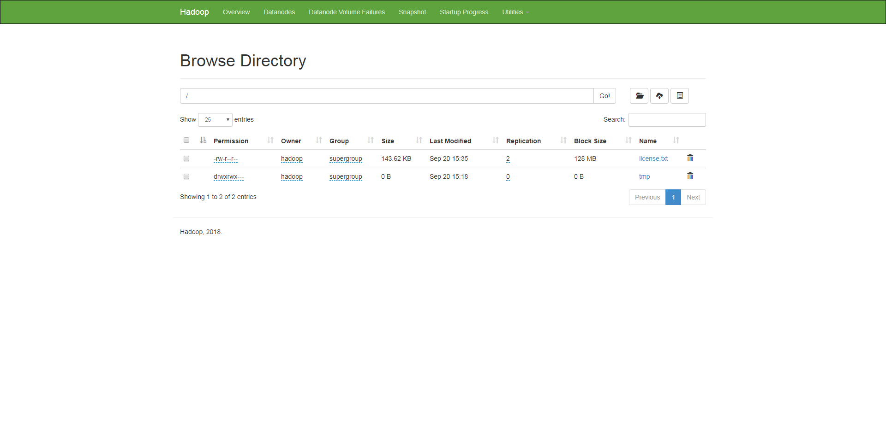
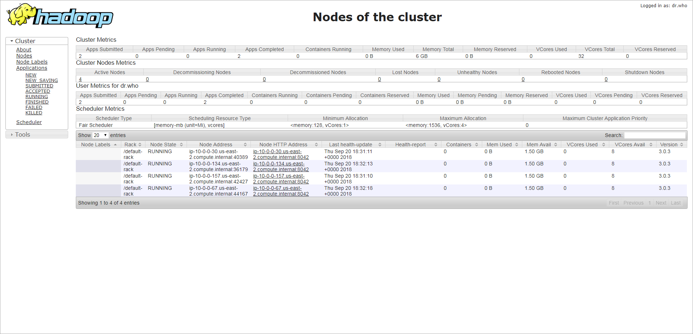
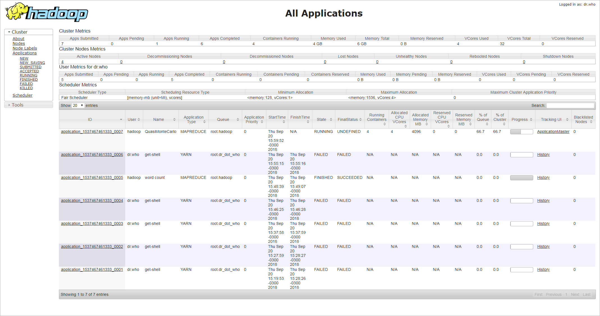
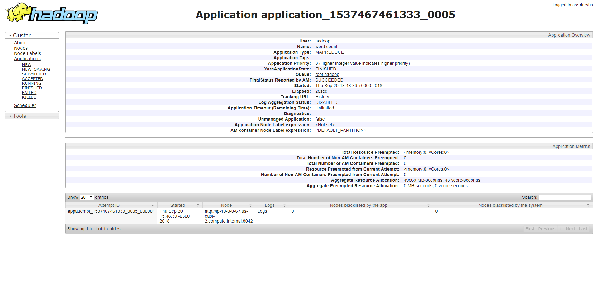
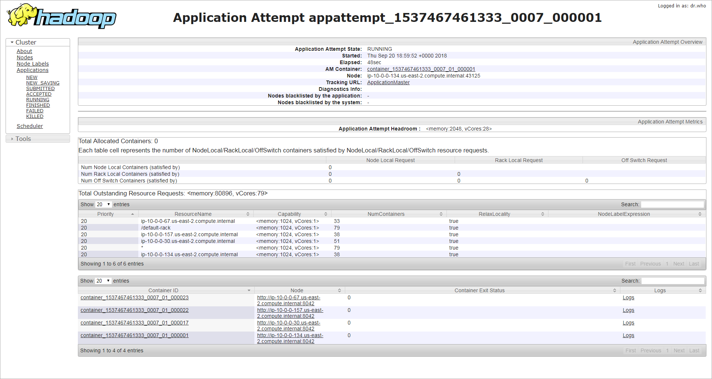

# Configuração de um cluster Haddop na AWS

## Características básicas

Para este exercício, não vamos nos preocupar com a segurança do cluster. Nosso foco é fazê-lo funcionar,
rodando aplicações MapReduce utilizando todos os nós do cluster.

Todas instâncias EC2 deverão possuir IP público para acesso externo via SSH. Para isso, elas deverãos estar
vinculadas a um SecurityGroup que permita o tráfego externo na porta SSH, originado do seu IP na internet,
e tráfego livre entre as máquinas do cluster.

Crie uma VPC com CIDR 10.0.0.0/16 e uma subnet para esta VPC com CIDR 10.0.0.0/24 e auto-concessão de IPs
públicos. Depois, crie um SecurityGroup com tráfego liberado para 10.0.0.0/16, tráfego liberado na porta
SSH para seu IP na internet e tráfego liberado nas portas 9870, 8088 e 19888 para qualquer IP.

## Passo a passo para configuração e inicialização do Hadoop

1. Inicie uma instância t2.micro com AMI Amazon Linux. Acesse a instância via SSH e execute a sequência de comandos
abaixo para instalar e configurar o Hadoop:
    ```
       $> sudo yum update -y
       $> sudo yum install java-1.8.0-openjdk -y
       $> sudo alternatives --config java (selecione então a versão 1.8.0)
       $> sudo wget http://mirrors.advancedhosters.com/apache/hadoop/common/hadoop-3.0.3/hadoop-3.0.3.tar.gz
       $> sudo tar -xzvf hadoop-3.0.3.tar.gz -C /opt/
       $> sudo ln -s /opt/hadoop-3.0.3 /opt/hadoop
       $> sudo useradd -d /opt/hadoop -M hadoop
       $> sudo chown -R hadoop: /opt/hadoop /opt/hadoop-3.0.3
       $> sudo mkdir /var/lib/hadoop
       $> sudo mkdir /var/lib/hadoop/hdfs
       $> sudo mkdir /var/lib/hadoop/hdfs/namenode
       $> sudo mkdir /var/lib/hadoop/hdfs/datanode
       $> sudo chown -R hadoop: /var/lib/hadoop
       $> sudo vi /etc/profile.d/hadoop.sh [- colocar aqui o conteúdo do arquivo cfg/hadoop.sh -]
       $> sudo su - hadoop
       hadoop.$> vi etc/hadoop/core-site.xml [- colocar aqui o conteúdo do arquivo cfg/core-site.xml -]
       hadoop.$> vi etc/hadoop/hdfs-site.xml [- colocar aqui o conteúdo do arquivo cfg/hdfs-site.xml -]
       hadoop.$> vi etc/hadoop/yarn-site.xml [- colocar aqui o conteúdo do arquivo cfg/yarn-site.xml -]
       hadoop.$> vi etc/hadoop/mapred-site.xml [- colocar aqui o conteúdo do arquivo cfg/mapred-site.xml -]
       hadoop.$> hdfs namenode -format hadoop
    ```

2. Desligue a instância sem terminá-la e crie uma imagem AMI a partir da mesma, que será depois utilizada para criar
o nó master e os nós slaves do Hadoop. Esta máquina será posteriormente utilizada como cliente para executar aplicações
MapReduce no cluster.

3. Inicie uma instância t2.small a partir da imagem AMI criada para servir como master e fixe seu IP interno em
**10.0.0.100**. Acesse a instância via SSH e execute a sequência de comandos abaixo para iniciar/parar o nó master do
Hadoop:
    ```
       $> sudo su - hadoop
       hadoop.$> hdfs --daemon start/stop namenode
       hadoop.$> yarn --daemon start/stop resourcemanager
       hadoop.$> mapred --daemon start/stop historyserver
    ```

4. Inicie N instâncias t2.small a partir da imagem AMI criada para servirem como slaves. Acesse cada instância via SSH e
execute a sequência de comandos abaixo para iniciar/parar o nó slave do Hadoop:
    ```
       $> sudo su - hadoop
       hadoop.$> hdfs --daemon start/stop datanode
       hadoop.$> yarn --daemon start/stop nodemanager
    ```

#### Máquina Client ####


#### Máquina Master ####


#### Máquina Slave ####


## Testando a implementação

1. Acesse as páginas de monitoramento do Hadoop no seu navegador utilizando o IP/DNS público da sua máquina master:
   * http://{ip-publico-master}:9870
   * http://{ip-publico-master}:8088
   * http://{ip-publico-master}:19888

2. Acesse a instância cliente via SSH para efetuar testes no HDFS e testar a execução de aplicações MapReduce. Para
executar os comandos do hadoop você deve acessar o shell como um usuário haddop: `sudo su - hadoop`

3. Envie um arquivo de texto (como por exemplo o LICENSE.txt do hadoop) para testar o HDFS e preparar para testar a
aplicação MapReduce WordCount: `hadoop dfs -put ./LICENSE.txt /license.txt`

4. Teste o envio do arquivo listando o conteúdo do diretório raiz do HDFS: `hadoop dfs -ls /`

5. Execute a aplicação MapReduce WordCount: `hadoop jar ./share/hadoop/mapreduce/hadoop-mapreduce-examples-3.0.3.jar wordcount /license.txt /wordcount`

6. Obtenha o resultado do processamento: `hadoop dfs -get /wordcount`

5. Execute a aplicação MapReduce PI: `hadoop jar ./share/hadoop/mapreduce/hadoop-mapreduce-examples-3.0.3.jar pi 100 100`

#### HDFS Monitor ####


#### HDFS Browser ####


#### YARN Monitor ####


#### YARN Status ####


#### YARN Nodes ####


## Resultados dos testes ##

### WordCount ###



<pre>
-bash-4.2$ hadoop jar ./share/hadoop/mapreduce/hadoop-mapreduce-examples-3.0.3.jar wordcount /license.txt /result1
2018-09-20 18:48:36,011 WARN util.NativeCodeLoader: Unable to load native-hadoop library for your platform... using builtin-java classes where applicable
2018-09-20 18:48:37,262 INFO client.RMProxy: Connecting to ResourceManager at /10.0.0.100:8032
2018-09-20 18:48:37,980 INFO mapreduce.JobResourceUploader: Disabling Erasure Coding for path: /tmp/hadoop-yarn/staging/hadoop/.staging/job_1537467461333_0005
2018-09-20 18:48:38,479 INFO input.FileInputFormat: Total input files to process : 1
2018-09-20 18:48:38,757 INFO mapreduce.JobSubmitter: number of splits:1
2018-09-20 18:48:38,849 INFO Configuration.deprecation: yarn.resourcemanager.system-metrics-publisher.enabled is deprecated. Instead, use yarn.system-metrics-publisher.enabled
2018-09-20 18:48:39,080 INFO mapreduce.JobSubmitter: Submitting tokens for job: job_1537467461333_0005
2018-09-20 18:48:39,081 INFO mapreduce.JobSubmitter: Executing with tokens: []
2018-09-20 18:48:39,401 INFO conf.Configuration: resource-types.xml not found
2018-09-20 18:48:39,401 INFO resource.ResourceUtils: Unable to find 'resource-types.xml'.
2018-09-20 18:48:39,550 INFO impl.YarnClientImpl: Submitted application application_1537467461333_0005
2018-09-20 18:48:39,619 INFO mapreduce.Job: The url to track the job: http://ip-10-0-0-100.us-east-2.compute.internal:8088/proxy/application_1537467461333_0005/
2018-09-20 18:48:39,620 INFO mapreduce.Job: Running job: job_1537467461333_0005
2018-09-20 18:48:50,895 INFO mapreduce.Job: Job job_1537467461333_0005 running in uber mode : false
2018-09-20 18:48:50,897 INFO mapreduce.Job:  map 0% reduce 0%
2018-09-20 18:48:59,001 INFO mapreduce.Job:  map 100% reduce 0%
2018-09-20 18:49:09,085 INFO mapreduce.Job:  map 100% reduce 100%
2018-09-20 18:49:09,096 INFO mapreduce.Job: Job job_1537467461333_0005 completed successfully
2018-09-20 18:49:09,213 INFO mapreduce.Job: Counters: 53
        File System Counters
                FILE: Number of bytes read=46198
                FILE: Number of bytes written=495951
                FILE: Number of read operations=0
                FILE: Number of large read operations=0
                FILE: Number of write operations=0
                HDFS: Number of bytes read=147165
                HDFS: Number of bytes written=34742
                HDFS: Number of read operations=8
                HDFS: Number of large read operations=0
                HDFS: Number of write operations=2
        Job Counters
                Launched map tasks=1
                Launched reduce tasks=1
                Rack-local map tasks=1
                Total time spent by all maps in occupied slots (ms)=49656
                Total time spent by all reduces in occupied slots (ms)=50296
                Total time spent by all map tasks (ms)=6207
                Total time spent by all reduce tasks (ms)=6287
                Total vcore-milliseconds taken by all map tasks=6207
                Total vcore-milliseconds taken by all reduce tasks=6287
                Total megabyte-milliseconds taken by all map tasks=6355968
                Total megabyte-milliseconds taken by all reduce tasks=6437888
        Map-Reduce Framework
                Map input records=2745
                Map output records=21453
                Map output bytes=228751
                Map output materialized bytes=46198
                Input split bytes=99
                Combine input records=21453
                Combine output records=2960
                Reduce input groups=2960
                Reduce shuffle bytes=46198
                Reduce input records=2960
                Reduce output records=2960
                Spilled Records=5920
                Shuffled Maps =1
                Failed Shuffles=0
                Merged Map outputs=1
                GC time elapsed (ms)=163
                CPU time spent (ms)=1450
                Physical memory (bytes) snapshot=390594560
                Virtual memory (bytes) snapshot=5563949056
                Total committed heap usage (bytes)=199364608
                Peak Map Physical memory (bytes)=270680064
                Peak Map Virtual memory (bytes)=2768072704
                Peak Reduce Physical memory (bytes)=119914496
                Peak Reduce Virtual memory (bytes)=2795876352
        Shuffle Errors
                BAD_ID=0
                CONNECTION=0
                IO_ERROR=0
                WRONG_LENGTH=0
                WRONG_MAP=0
                WRONG_REDUCE=0
        File Input Format Counters
                Bytes Read=147066
        File Output Format Counters
                Bytes Written=34742
</pre>

Veja resultado em: [result/wordcount/part-r-00000](./result/wordcount/part-r-00000)

### PI ###



<pre>
-bash-4.2$ hadoop jar ./share/hadoop/mapreduce/hadoop-mapreduce-examples-3.0.3.jar pi 100 100
Number of Maps  = 100
Samples per Map = 100
2018-09-20 18:59:46,788 WARN util.NativeCodeLoader: Unable to load native-hadoop library for your platform... using builtin-java classes where applicable
Wrote input for Map #0
Wrote input for Map #1
Wrote input for Map #2
Wrote input for Map #3
Wrote input for Map #4
Wrote input for Map #5
Wrote input for Map #6
Wrote input for Map #7
Wrote input for Map #8
Wrote input for Map #9
Wrote input for Map #10
Wrote input for Map #11
Wrote input for Map #12
Wrote input for Map #13
Wrote input for Map #14
Wrote input for Map #15
Wrote input for Map #16
Wrote input for Map #17
Wrote input for Map #18
Wrote input for Map #19
Wrote input for Map #20
Wrote input for Map #21
Wrote input for Map #22
Wrote input for Map #23
Wrote input for Map #24
Wrote input for Map #25
Wrote input for Map #26
Wrote input for Map #27
Wrote input for Map #28
Wrote input for Map #29
Wrote input for Map #30
Wrote input for Map #31
Wrote input for Map #32
Wrote input for Map #33
2018-09-20 18:59:49,169 WARN hdfs.DataStreamer: Caught exception
java.lang.InterruptedException
        at java.lang.Object.wait(Native Method)
        at java.lang.Thread.join(Thread.java:1252)
        at java.lang.Thread.join(Thread.java:1326)
        at org.apache.hadoop.hdfs.DataStreamer.closeResponder(DataStreamer.java:986)
        at org.apache.hadoop.hdfs.DataStreamer.endBlock(DataStreamer.java:640)
        at org.apache.hadoop.hdfs.DataStreamer.run(DataStreamer.java:810)
Wrote input for Map #34
2018-09-20 18:59:49,194 WARN hdfs.DataStreamer: Caught exception
java.lang.InterruptedException
        at java.lang.Object.wait(Native Method)
        at java.lang.Thread.join(Thread.java:1252)
        at java.lang.Thread.join(Thread.java:1326)
        at org.apache.hadoop.hdfs.DataStreamer.closeResponder(DataStreamer.java:986)
        at org.apache.hadoop.hdfs.DataStreamer.endBlock(DataStreamer.java:640)
        at org.apache.hadoop.hdfs.DataStreamer.run(DataStreamer.java:810)
Wrote input for Map #35
Wrote input for Map #36
Wrote input for Map #37
Wrote input for Map #38
Wrote input for Map #39
Wrote input for Map #40
Wrote input for Map #41
Wrote input for Map #42
Wrote input for Map #43
Wrote input for Map #44
Wrote input for Map #45
Wrote input for Map #46
Wrote input for Map #47
Wrote input for Map #48
Wrote input for Map #49
Wrote input for Map #50
Wrote input for Map #51
Wrote input for Map #52
Wrote input for Map #53
Wrote input for Map #54
Wrote input for Map #55
Wrote input for Map #56
Wrote input for Map #57
Wrote input for Map #58
Wrote input for Map #59
Wrote input for Map #60
Wrote input for Map #61
Wrote input for Map #62
Wrote input for Map #63
Wrote input for Map #64
Wrote input for Map #65
Wrote input for Map #66
Wrote input for Map #67
Wrote input for Map #68
Wrote input for Map #69
Wrote input for Map #70
Wrote input for Map #71
Wrote input for Map #72
Wrote input for Map #73
Wrote input for Map #74
Wrote input for Map #75
Wrote input for Map #76
Wrote input for Map #77
Wrote input for Map #78
Wrote input for Map #79
Wrote input for Map #80
Wrote input for Map #81
Wrote input for Map #82
Wrote input for Map #83
Wrote input for Map #84
Wrote input for Map #85
Wrote input for Map #86
Wrote input for Map #87
Wrote input for Map #88
Wrote input for Map #89
Wrote input for Map #90
Wrote input for Map #91
Wrote input for Map #92
Wrote input for Map #93
2018-09-20 18:59:50,554 WARN hdfs.DataStreamer: Caught exception
java.lang.InterruptedException
        at java.lang.Object.wait(Native Method)
        at java.lang.Thread.join(Thread.java:1252)
        at java.lang.Thread.join(Thread.java:1326)
        at org.apache.hadoop.hdfs.DataStreamer.closeResponder(DataStreamer.java:986)
        at org.apache.hadoop.hdfs.DataStreamer.endBlock(DataStreamer.java:640)
        at org.apache.hadoop.hdfs.DataStreamer.run(DataStreamer.java:810)
Wrote input for Map #94
Wrote input for Map #95
Wrote input for Map #96
Wrote input for Map #97
Wrote input for Map #98
Wrote input for Map #99
Starting Job
2018-09-20 18:59:50,763 INFO client.RMProxy: Connecting to ResourceManager at /10.0.0.100:8032
2018-09-20 18:59:51,233 INFO mapreduce.JobResourceUploader: Disabling Erasure Coding for path: /tmp/hadoop-yarn/staging/hadoop/.staging/job_1537467461333_0007
2018-09-20 18:59:51,471 INFO input.FileInputFormat: Total input files to process : 100
2018-09-20 18:59:51,556 INFO mapreduce.JobSubmitter: number of splits:100
2018-09-20 18:59:51,594 INFO Configuration.deprecation: yarn.resourcemanager.system-metrics-publisher.enabled is deprecated. Instead, use yarn.system-metrics-publisher.enabled
2018-09-20 18:59:51,783 INFO mapreduce.JobSubmitter: Submitting tokens for job: job_1537467461333_0007
2018-09-20 18:59:51,785 INFO mapreduce.JobSubmitter: Executing with tokens: []
2018-09-20 18:59:52,101 INFO conf.Configuration: resource-types.xml not found
2018-09-20 18:59:52,102 INFO resource.ResourceUtils: Unable to find 'resource-types.xml'.
2018-09-20 18:59:52,194 INFO impl.YarnClientImpl: Submitted application application_1537467461333_0007
2018-09-20 18:59:52,249 INFO mapreduce.Job: The url to track the job: http://ip-10-0-0-100.us-east-2.compute.internal:8088/proxy/application_1537467461333_0007/
2018-09-20 18:59:52,255 INFO mapreduce.Job: Running job: job_1537467461333_0007
2018-09-20 19:00:01,536 INFO mapreduce.Job: Job job_1537467461333_0007 running in uber mode : false
2018-09-20 19:00:01,537 INFO mapreduce.Job:  map 0% reduce 0%
2018-09-20 19:00:09,706 INFO mapreduce.Job:  map 3% reduce 0%
2018-09-20 19:00:13,736 INFO mapreduce.Job:  map 4% reduce 0%
2018-09-20 19:00:14,744 INFO mapreduce.Job:  map 6% reduce 0%
2018-09-20 19:00:18,764 INFO mapreduce.Job:  map 7% reduce 0%
2018-09-20 19:00:19,774 INFO mapreduce.Job:  map 8% reduce 0%
2018-09-20 19:00:20,779 INFO mapreduce.Job:  map 9% reduce 0%
2018-09-20 19:00:23,793 INFO mapreduce.Job:  map 10% reduce 0%
2018-09-20 19:00:24,800 INFO mapreduce.Job:  map 12% reduce 0%
2018-09-20 19:00:28,831 INFO mapreduce.Job:  map 13% reduce 0%
2018-09-20 19:00:29,837 INFO mapreduce.Job:  map 15% reduce 0%
2018-09-20 19:00:34,872 INFO mapreduce.Job:  map 16% reduce 0%
2018-09-20 19:00:35,876 INFO mapreduce.Job:  map 17% reduce 0%
2018-09-20 19:00:39,897 INFO mapreduce.Job:  map 19% reduce 0%
2018-09-20 19:00:44,924 INFO mapreduce.Job:  map 21% reduce 0%
2018-09-20 19:00:45,927 INFO mapreduce.Job:  map 21% reduce 6%
2018-09-20 19:00:49,948 INFO mapreduce.Job:  map 22% reduce 6%
2018-09-20 19:00:50,953 INFO mapreduce.Job:  map 23% reduce 6%
2018-09-20 19:00:51,960 INFO mapreduce.Job:  map 23% reduce 8%
2018-09-20 19:00:54,972 INFO mapreduce.Job:  map 25% reduce 8%
2018-09-20 19:00:59,996 INFO mapreduce.Job:  map 26% reduce 8%
2018-09-20 19:01:01,003 INFO mapreduce.Job:  map 27% reduce 8%
2018-09-20 19:01:04,019 INFO mapreduce.Job:  map 27% reduce 9%
2018-09-20 19:01:05,026 INFO mapreduce.Job:  map 28% reduce 9%
2018-09-20 19:01:06,034 INFO mapreduce.Job:  map 29% reduce 9%
2018-09-20 19:01:10,049 INFO mapreduce.Job:  map 30% reduce 10%
2018-09-20 19:01:12,057 INFO mapreduce.Job:  map 31% reduce 10%
2018-09-20 19:01:15,074 INFO mapreduce.Job:  map 32% reduce 10%
2018-09-20 19:01:16,078 INFO mapreduce.Job:  map 32% reduce 11%
2018-09-20 19:01:17,084 INFO mapreduce.Job:  map 33% reduce 11%
2018-09-20 19:01:20,102 INFO mapreduce.Job:  map 34% reduce 11%
2018-09-20 19:01:22,114 INFO mapreduce.Job:  map 35% reduce 12%
2018-09-20 19:01:25,132 INFO mapreduce.Job:  map 36% reduce 12%
2018-09-20 19:01:27,145 INFO mapreduce.Job:  map 37% reduce 12%
2018-09-20 19:01:30,156 INFO mapreduce.Job:  map 38% reduce 12%
2018-09-20 19:01:32,169 INFO mapreduce.Job:  map 39% reduce 12%
2018-09-20 19:01:34,180 INFO mapreduce.Job:  map 39% reduce 13%
2018-09-20 19:01:35,184 INFO mapreduce.Job:  map 40% reduce 13%
2018-09-20 19:01:36,188 INFO mapreduce.Job:  map 41% reduce 13%
2018-09-20 19:01:40,204 INFO mapreduce.Job:  map 42% reduce 14%
2018-09-20 19:01:42,211 INFO mapreduce.Job:  map 43% reduce 14%
2018-09-20 19:01:45,222 INFO mapreduce.Job:  map 44% reduce 14%
2018-09-20 19:01:46,226 INFO mapreduce.Job:  map 44% reduce 15%
2018-09-20 19:01:47,231 INFO mapreduce.Job:  map 45% reduce 15%
2018-09-20 19:01:50,245 INFO mapreduce.Job:  map 46% reduce 15%
2018-09-20 19:01:51,249 INFO mapreduce.Job:  map 47% reduce 15%
2018-09-20 19:01:52,254 INFO mapreduce.Job:  map 47% reduce 16%
2018-09-20 19:01:55,270 INFO mapreduce.Job:  map 48% reduce 16%
2018-09-20 19:01:57,279 INFO mapreduce.Job:  map 49% reduce 16%
2018-09-20 19:02:00,293 INFO mapreduce.Job:  map 50% reduce 16%
2018-09-20 19:02:02,300 INFO mapreduce.Job:  map 51% reduce 16%
2018-09-20 19:02:04,307 INFO mapreduce.Job:  map 51% reduce 17%
2018-09-20 19:02:05,310 INFO mapreduce.Job:  map 52% reduce 17%
2018-09-20 19:02:06,313 INFO mapreduce.Job:  map 53% reduce 17%
2018-09-20 19:02:10,328 INFO mapreduce.Job:  map 54% reduce 18%
2018-09-20 19:02:12,335 INFO mapreduce.Job:  map 55% reduce 18%
2018-09-20 19:02:15,350 INFO mapreduce.Job:  map 56% reduce 18%
2018-09-20 19:02:16,354 INFO mapreduce.Job:  map 57% reduce 19%
2018-09-20 19:02:20,377 INFO mapreduce.Job:  map 58% reduce 19%
2018-09-20 19:02:21,384 INFO mapreduce.Job:  map 59% reduce 19%
2018-09-20 19:02:22,388 INFO mapreduce.Job:  map 59% reduce 20%
2018-09-20 19:02:25,398 INFO mapreduce.Job:  map 60% reduce 20%
2018-09-20 19:02:26,402 INFO mapreduce.Job:  map 61% reduce 20%
2018-09-20 19:02:30,418 INFO mapreduce.Job:  map 62% reduce 20%
2018-09-20 19:02:31,426 INFO mapreduce.Job:  map 63% reduce 20%
2018-09-20 19:02:34,435 INFO mapreduce.Job:  map 63% reduce 21%
2018-09-20 19:02:35,440 INFO mapreduce.Job:  map 64% reduce 21%
2018-09-20 19:02:36,447 INFO mapreduce.Job:  map 65% reduce 21%
2018-09-20 19:02:40,468 INFO mapreduce.Job:  map 66% reduce 22%
2018-09-20 19:02:41,474 INFO mapreduce.Job:  map 67% reduce 22%
2018-09-20 19:02:45,489 INFO mapreduce.Job:  map 68% reduce 22%
2018-09-20 19:02:46,494 INFO mapreduce.Job:  map 68% reduce 23%
2018-09-20 19:02:47,497 INFO mapreduce.Job:  map 69% reduce 23%
2018-09-20 19:02:50,507 INFO mapreduce.Job:  map 70% reduce 23%
2018-09-20 19:02:52,516 INFO mapreduce.Job:  map 71% reduce 24%
2018-09-20 19:02:55,527 INFO mapreduce.Job:  map 72% reduce 24%
2018-09-20 19:02:56,531 INFO mapreduce.Job:  map 73% reduce 24%
2018-09-20 19:03:00,558 INFO mapreduce.Job:  map 74% reduce 24%
2018-09-20 19:03:01,561 INFO mapreduce.Job:  map 75% reduce 24%
2018-09-20 19:03:04,574 INFO mapreduce.Job:  map 75% reduce 25%
2018-09-20 19:03:05,578 INFO mapreduce.Job:  map 76% reduce 25%
2018-09-20 19:03:06,582 INFO mapreduce.Job:  map 77% reduce 25%
2018-09-20 19:03:10,602 INFO mapreduce.Job:  map 78% reduce 26%
2018-09-20 19:03:11,608 INFO mapreduce.Job:  map 79% reduce 26%
2018-09-20 19:03:15,624 INFO mapreduce.Job:  map 80% reduce 26%
2018-09-20 19:03:16,628 INFO mapreduce.Job:  map 81% reduce 27%
2018-09-20 19:03:20,644 INFO mapreduce.Job:  map 82% reduce 27%
2018-09-20 19:03:21,648 INFO mapreduce.Job:  map 83% reduce 27%
2018-09-20 19:03:22,651 INFO mapreduce.Job:  map 83% reduce 28%
2018-09-20 19:03:25,662 INFO mapreduce.Job:  map 84% reduce 28%
2018-09-20 19:03:26,665 INFO mapreduce.Job:  map 85% reduce 28%
2018-09-20 19:03:30,679 INFO mapreduce.Job:  map 86% reduce 28%
2018-09-20 19:03:31,686 INFO mapreduce.Job:  map 87% reduce 28%
2018-09-20 19:03:34,695 INFO mapreduce.Job:  map 87% reduce 29%
2018-09-20 19:03:35,704 INFO mapreduce.Job:  map 88% reduce 29%
2018-09-20 19:03:36,710 INFO mapreduce.Job:  map 89% reduce 29%
2018-09-20 19:03:40,722 INFO mapreduce.Job:  map 90% reduce 30%
2018-09-20 19:03:41,727 INFO mapreduce.Job:  map 91% reduce 30%
2018-09-20 19:03:45,740 INFO mapreduce.Job:  map 92% reduce 30%
2018-09-20 19:03:46,744 INFO mapreduce.Job:  map 93% reduce 31%
2018-09-20 19:03:50,757 INFO mapreduce.Job:  map 94% reduce 31%
2018-09-20 19:03:51,761 INFO mapreduce.Job:  map 95% reduce 31%
2018-09-20 19:03:52,764 INFO mapreduce.Job:  map 95% reduce 32%
2018-09-20 19:03:55,778 INFO mapreduce.Job:  map 96% reduce 32%
2018-09-20 19:03:56,781 INFO mapreduce.Job:  map 97% reduce 32%
2018-09-20 19:04:00,794 INFO mapreduce.Job:  map 98% reduce 32%
2018-09-20 19:04:01,801 INFO mapreduce.Job:  map 99% reduce 32%
2018-09-20 19:04:04,815 INFO mapreduce.Job:  map 99% reduce 33%
2018-09-20 19:04:05,818 INFO mapreduce.Job:  map 100% reduce 33%
2018-09-20 19:04:06,823 INFO mapreduce.Job:  map 100% reduce 100%
2018-09-20 19:04:06,829 INFO mapreduce.Job: Job job_1537467461333_0007 completed successfully
2018-09-20 19:04:06,975 INFO mapreduce.Job: Counters: 54
        File System Counters
                FILE: Number of bytes read=2206
                FILE: Number of bytes written=20422898
                FILE: Number of read operations=0
                FILE: Number of large read operations=0
                FILE: Number of write operations=0
                HDFS: Number of bytes read=26790
                HDFS: Number of bytes written=215
                HDFS: Number of read operations=405
                HDFS: Number of large read operations=0
                HDFS: Number of write operations=3
        Job Counters
                Launched map tasks=100
                Launched reduce tasks=1
                Data-local map tasks=84
                Rack-local map tasks=16
                Total time spent by all maps in occupied slots (ms)=3412776
                Total time spent by all reduces in occupied slots (ms)=1734504
                Total time spent by all map tasks (ms)=426597
                Total time spent by all reduce tasks (ms)=216813
                Total vcore-milliseconds taken by all map tasks=426597
                Total vcore-milliseconds taken by all reduce tasks=216813
                Total megabyte-milliseconds taken by all map tasks=436835328
                Total megabyte-milliseconds taken by all reduce tasks=222016512
        Map-Reduce Framework
                Map input records=100
                Map output records=200
                Map output bytes=1800
                Map output materialized bytes=2800
                Input split bytes=14990
                Combine input records=0
                Combine output records=0
                Reduce input groups=2
                Reduce shuffle bytes=2800
                Reduce input records=200
                Reduce output records=0
                Spilled Records=400
                Shuffled Maps =100
                Failed Shuffles=0
                Merged Map outputs=100
                GC time elapsed (ms)=9822
                CPU time spent (ms)=50710
                Physical memory (bytes) snapshot=26863902720
                Virtual memory (bytes) snapshot=279604969472
                Total committed heap usage (bytes)=16711892992
                Peak Map Physical memory (bytes)=273256448
                Peak Map Virtual memory (bytes)=2768072704
                Peak Reduce Physical memory (bytes)=139214848
                Peak Reduce Virtual memory (bytes)=2797699072
        Shuffle Errors
                BAD_ID=0
                CONNECTION=0
                IO_ERROR=0
                WRONG_LENGTH=0
                WRONG_MAP=0
                WRONG_REDUCE=0
        File Input Format Counters
                Bytes Read=11800
        File Output Format Counters
                Bytes Written=97
Job Finished in 256.331 seconds
Estimated value of Pi is 3.14080000000000000000
</pre>